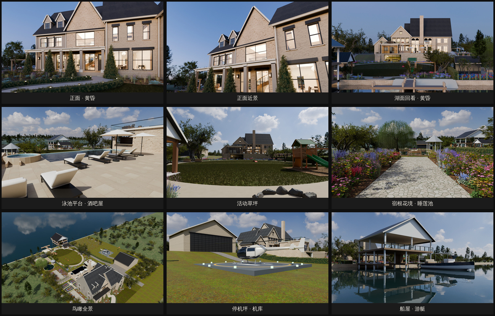
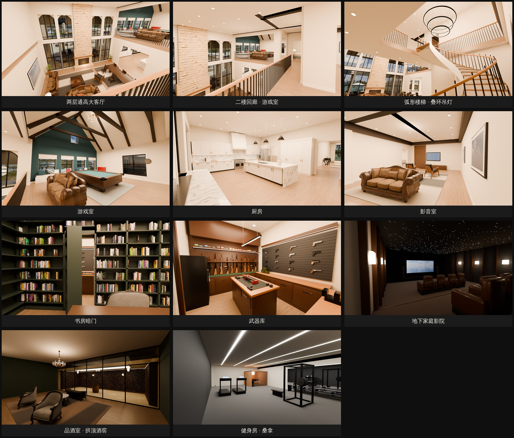

# 湖景豪宅 3D 模型（照片级）

外观照 AI 效果图（奶油色砖、石灰岩山墙、灰褐横挂板、炭灰沥青瓦、黑色窗框、深古铜金属门廊屋面），室内照两段看房视频。整套模型都是 Python 脚本在 Blender 里程序化生成，用 Cycles 路径追踪渲染。贴图、HDRI 天空、家具和植物模型都来自 Poly Haven（CC0 授权）。

## 效果图





`renders/final/` 里是最终效果图（JPG，Cycles 128 采样 + 降噪）。外景：

| 文件 | 画面 |
|---|---|
| `front.jpg` | 正面黄昏，对齐 AI 图机位 |
| `front_close.jpg` | 正面近景：石灰岩山墙、门廊、龙舌兰花池和黄杨绿篱 |
| `lake.jpg` | 从湖面回看黄昏中的房子，泳池平台下的湖景休闲厅亮灯 |
| `pool.jpg` | 泳池平台：躺椅、SPA、泳池边酒吧屋（屋顶露台） |
| `lawn.jpg` | 活动草坪：秋千橡树、雪松游乐设施、烧烤亭、火坑 |
| `garden.jpg` | 宿根花境石板路，看向睡莲池、垂柳和凉亭 |
| `aerial.jpg` | 鸟瞰全景：主屋、花园、泳池、船屋、车库、机库和停机坪 |
| `heli.jpg` | 停机坪上的直升机和机库 |
| `dock.jpg` | 船屋和游艇 |

室内：

| 文件 | 画面 |
|---|---|
| `int_great.jpg` | 两层通高大客厅（石灰岩通高壁炉、拱窗、环形吊灯餐区），从二楼回廊往下看 |
| `int_loft.jpg` | 从楼梯平台看挑空和二楼游戏室 |
| `int_stair.jpg` | 门厅弧形楼梯和叠环 LED 吊灯 |
| `int_game.jpg` | 游戏室：深咖色木桁架、蓝绿山墙、台球桌、星芒吊灯、窗台座榻 |
| `int_kitchen.jpg` | 厨房：白色 shaker 橱柜、大理石瀑布岛台、48 寸炉灶和石膏烟罩 |
| `int_media.jpg` | 二楼影音室：木条电视墙、回字形吊顶 |
| `int_secret.jpg` | 书房书墙里的暗门打开，后面是武器库 |
| `int_armory.jpg` | 武器库：步枪架、手枪墙、枪柜、展示柜、岛台、工具墙 |
| `int_cinema.jpg` | 地下家庭影院：星空顶、阶梯真皮躺椅 |
| `int_wine.jpg` | 品酒室和玻璃隔断后的拱顶酒窖 |
| `int_gym.jpg` | 地下健身房和雪松桑拿房 |

## 目录

| 路径 | 内容 |
|---|---|
| `design/` | 总平面、负一层平面和剖面、酒吧屋平面、植物选型页、参考图 |
| `model/build_final.py` | **照片级总入口**：搭场景、打光、出全部效果图 |
| `model/build_massing.py` | 地形、湖、泳池平台、船屋、停机坪、机库等场地体块，以及相机 |
| `model/house_real.py` | 主屋真实构造：有墙厚的外墙、楼板、内隔墙、门窗洞口、屋顶、房间表 |
| `model/facade.py` | 窗框、格条、拱窗、前门、窗套窗台、封檐板、檐沟落水管 |
| `model/assets.py` | Poly Haven 资源下载和缓存（HDRI、PBR 贴图、模型） |
| `model/materials_pbr.py` | 真实贴图材质（砖、石灰岩、沥青瓦、木地板、草坪等），按 AI 图配色调色 |
| `model/interiors.py` | 室内：弧形楼梯、各房间家具、窗帘、灯具、厨房、大客厅、游戏室、主卧 |
| `model/armory.py` | 武器库和书房暗门（程序化枪械和工具） |
| `model/lowerlevel.py` | 地下层：影院、酒窖、品酒室、健身房桑拿、湖景休闲厅 |
| `model/front_yard.py` | 前院植物（龙舌兰、黄杨绿篱、锥形冬青、观赏草、橡树、玉兰、草坪） |
| `model/rear_yard.py` | 后院六个主题花园、活动草坪、湖岸、野花草地、树林 |
| `model/vegetation.py` | 植物实例化和程序化植物（龙舌兰、观赏草、薰衣草、鼠尾草、玫瑰、绣球、垂柳等） |
| `model/outdoor.py`, `outdoor2.py` | 泳池、户外家具、酒吧屋、游乐设施、烧烤亭、花园石板路、远岸森林、夜景灯 |
| `model/vehicles.py` | 直升机和游艇 |
| `model/props.py` | Poly Haven 家具的导入和摆放 |
| `renders/` | `massing/` 白模、`detail/` 细节阶段、`final/` 最终效果图 |

## 坐标约定

- X：从地块左边线往右，单位米
- Y：从街道往湖的方向；湖岸线在 Y = 100
- Z：主层地面为 ±0；地下层 −3.9（湖景休闲厅 −3.3）；湖常水位 −5.0
- 层高：一层 4.0 m，二层 3.4 m

## 运行

需要 Blender 4.2 的 Python 模块（Python 3.11）：

```bash
python3.11 -m venv venv && venv/bin/pip install bpy==4.2.0
cd house/model
../../venv/bin/python build_final.py --views front --preview          # 快速预览（半分辨率、32 采样）
../../venv/bin/python build_final.py --views front,lake,int_great       # 指定视角，高清
../../venv/bin/python build_final.py --skip-existing                    # 全部视角，已渲染的跳过
```

第一次运行会自动下载 Poly Haven 资源到 `house/assets/`（不进 git）。也可以用 Blender 程序运行：`blender -b -P build_final.py -- --views front`。生成的场景保存在 `model/final.blend`，可以直接用 Blender 打开浏览。

常用参数：`--samples N`、`--scale 0.5`、`--no-interior`、`--no-plants`。环境变量 `DUSK_EXPOSURE`、`INSIDE_EXPOSURE`、`SUN_E`、`ROOM_W` 可以调曝光和灯光。

CPU 渲染一张高清图要十几到几十分钟；有 NVIDIA 显卡时在 Blender 偏好设置里打开 OptiX/CUDA，会快很多。
